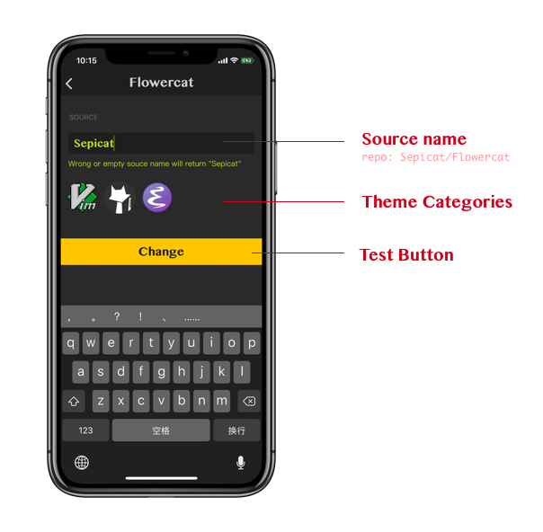
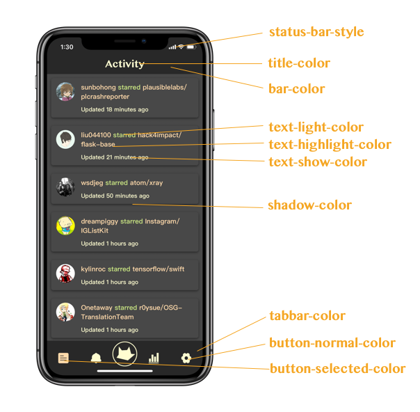

# Flowercat


## 简介

这是 *Sepicat* App 的云配文件，在规定的 JSON K-V 字典中可定制化 Sepicat 的样式。其思想来源于 VSCode 的配置文件。

## 进度

- [x] 完成个人定制化皮肤。
- [ ] Tabbar 小猫图片定制。
- [ ] 常用检索补全关键字表。

## 使用说明

在 *Sepicat* App 启动后，会根据 Source 来读取 **Flowercat** 配置，即 `****/Flowercat/config.json` 文件作为 App 的 **FlowercatConfig**。不做 Source 修改的情况下，App 将默认使用 *Sepicat/Flowercat* 中的全部配置。我们可以在 **Sepicat** 中 `Tools -> Setting -> Flowercat` 来进行修改 Source 操作。



### 自定义 Source

将 `Sepicat/Flowercat` Fork 到自己的 Repo 中，修改其配置文件即可。

### 配置定制化皮肤

如 `config.json` 中描述：

```json
"theme": {
    "Featured": {
        "image": "https://avatars0.githubusercontent.com/u/35451588?s=200&v=4",
        "url": "https://raw.githubusercontent.com/Sepicat/Flowercat/master/theme.json"
    },
    "Vim": {
        "image": "https://raw.githubusercontent.com/github/explore/6c6508f34230f0ac0d49e847a326429eefbfc030/topics/vim/vim.png",
        "url": "https://raw.githubusercontent.com/Sepicat/Flowercat/master/theme-vim.json"
    },
    "Emacs": {
        "image": "https://raw.githubusercontent.com/github/explore/f090041c611aee2a399eb2591e4f522713f62b50/topics/emacs/emacs.png",
        "url": "https://raw.githubusercontent.com/Sepicat/Flowercat/master/theme-emacs.json"
    }
}
```

`theme` 分成三组，其名字分别是 `Featured`、`Vim` 和 `Emacs`，并且对应了三份 `json` 文件的 `raw`，用于传递正确的 `json` 描述。这个 `url` 可以自行定义，只要保证其 `json` 格式是合法的 `theme` 就能被 *Sepicat* 正确读取。

在每个 `url` 中，我们可以发现 `json` 格式如下（例子是 Vim 经典 colorsheme -
desert.vim 的配色）:

```json
[
    {
        "name": "Desert.vim",
        "color-scheme": {
            "bar-color": "#282828",
            "tabbar-color": "#282828",
            "back-color": "#484848",
            "title-color": "#FFFDD0",
            "switch-color": "#87CEEB",
            "text-color": "#D8D8D8",
            "text-show-color": "#FFFDD0",
            "text-light-color": "#CAE682",
            "text-highlight-color": "#FFDAAB",
            "text-highhighlight-color": "#FFA0A0",
            "text-link-color": "#53DCCD",
            "button-normal-color": "#FFFDD0",
            "button-selected-color": "#FFDAAB",
            "shadow-color": "#000000"
        },
        "status-bar-style": "light-content",
        "user-login": "Desgard",
        "user-avatar-url": "https://raw.githubusercontent.com/github/explore/6c6508f34230f0ac0d49e847a326429eefbfc030/topics/vim/vim.png",
        "repo-fullname": "fugalh/desert.vim",
        "repo-introduce": "Vim 的经典原生配色。"
    }
]
```

* name: Theme 的主显名称
* color-sheme: 配色方案字典
    * bar-color: 导航栏底色
    * tabbar-color: Tab 选项栏底色
    * back-color: 背景色
    * title-color: 导航栏 Title 颜色
    * switch-color: 导航栏选项卡高亮色
    * text-color: 文本一般色，一般出现在不凸显的标题
    * text-show-color: 文本主显色，一般出现在 Description 信息、time 信息中
    * text-light-color: 文本亮色，一般出现在 title 中行为描述字体颜色
    * text-highlight-color: 文本高亮色，一般出现在可点击关键字题颜色、Cell Title 颜色等
    * text-highhighlight-color: 文本超高亮色，一般显示在关机字中加强字段颜色
    * text-link-color: 超链接文本色，用于展示 URL 链接文本
    * button-normal-color: tabbar 按钮正常状态下显示色
    * button-selected-color: tabbar 选中状态下显示色
    * shadow-color: 阴影配色
* status-bar-style: iOS 状态栏样式，仅有两种可选，白[light-content]、黑[default]
* user-login: 作者 GitHub Login Id
* user-avatar-url: 作者 GitHub Image 头像（当然你也可以填自定义的图）
* repo-fullname: 相关信息（如果你填写了 GitHub Name 的格式，便可在介绍页实现跳转）
* repo-introduce: Theme 简介信息




## Flowercat 社区

欢迎大家对 Theme PR，我将会汇总优秀的作品，这样可以为您的 GitHub 主页引流。
